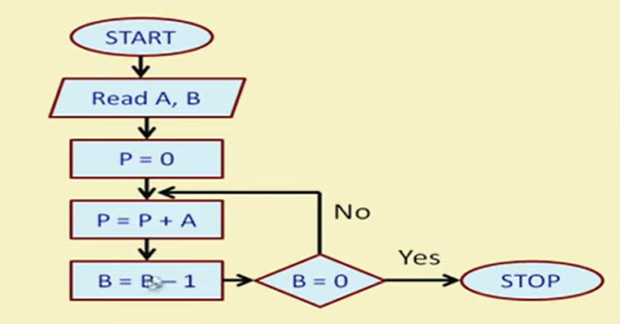

## Overview

- This project presents the RTL implementation of a **Sequential Multiplier** using **Verilog HDL**, based on the **repeated addition algorithm**. The design performs binary multiplication by repeatedly adding the multiplicand to an accumulator while decrementing the multiplier over successive clock cycles.

- The architecture follows a **modular datapath–control path design**, where the datapath consists of registers, an adder, a counter, and a zero comparator, while an **FSM-based controller** generates the control signals required to coordinate each stage of the multiplication process.

- The complete design has been **functionally verified using Xilinx Vivado** through simulation waveforms and console outputs. This project demonstrates key concepts of **RTL design**, **finite state machine (FSM) control**, **sequential digital circuits**, and **hardware implementation of arithmetic algorithms**, making it a valuable learning project for FPGA and ASIC design.

---
## Sequential Multiplication Algorithm

The **Sequential Multiplication Algorithm** performs binary multiplication by repeatedly adding the multiplicand to an accumulator based on the value of the multiplier. Instead of generating the product in a single clock cycle, the multiplication is carried out over multiple clock cycles, resulting in a hardware-efficient implementation with reduced circuit complexity.

### Working Principle

1. Load the **Multiplicand (M)** and **Multiplier (Q)** into their respective registers.
2. Initialize the **Accumulator (ACC)** to zero.
3. Check whether the multiplier is equal to zero.
4. If the multiplier is not zero:
   - Add the multiplicand to the accumulator.
   - Decrement the multiplier by one.
5. Repeat the addition and decrement operations until the multiplier becomes zero.
6. Once the multiplier reaches zero, the accumulator contains the final multiplication result.

  

<b>Fig. 1.</b> Flowchart of the Sequential Multiplication Algorithm.

---
## Architecture

The Sequential Multiplier is designed using a **modular datapath–control path architecture**, which separates the computational logic from the control logic. This design methodology improves modularity, simplifies debugging, and enhances the reusability of individual hardware modules.

The **datapath** performs the arithmetic operations, operand storage, and counter management required for multiplication, while the **control path** generates the control signals that coordinate the sequential execution of the repeated addition algorithm. Together, these two units ensure correct synchronization of every operation until the final product is generated.

  

<b>Fig. 2.</b> Overall architecture of the Sequential Multiplier showing the interaction between the datapath and control path.

---
### Datapath

The datapath is the computational unit of the Sequential Multiplier responsible for executing all arithmetic and data transfer operations during the multiplication process. It consists of an **Adder**, **Accumulator Register (ACC)**, **Multiplicand Register (M)**, **Multiplier Register (Q)**, **Counter**, and a **Zero Comparator (EQZ)**. These components work together to repeatedly add the multiplicand to the accumulator while decrementing the multiplier until the multiplication process is complete.

The datapath operates under the control of the FSM-based controller, which generates the required control signals for register loading, addition, counter updates, and result storage. Upon completion of all iterations, the accumulator holds the final multiplication result.

  

<b>Fig. 3.</b> Datapath architecture of the Sequential Multiplier.

---
### Control Path

The control path supervises the execution of the Sequential Multiplication Algorithm by generating the control signals required for the datapath. It is implemented as a **Finite State Machine (FSM)** that sequences the operations of initialization, register loading, repeated addition, counter decrementing, zero checking, and completion.

Based on the output of the **Zero Comparator (EQZ)** and the current FSM state, the controller determines the next operation to be performed. This coordinated interaction between the control path and datapath ensures that the multiplication is executed correctly over successive clock cycles until the final product is obtained.

  

<b>Fig. 4.</b> Control path architecture of the Sequential Multiplier.

---
### Datapath–Control Path Connection

The Sequential Multiplier follows a coordinated **datapath–control path architecture**, where both units interact continuously to execute the multiplication process. The **control path** generates the necessary control signals based on the current state of the FSM and the output of the **Zero Comparator (EQZ)**, while the **datapath** performs the corresponding arithmetic and register operations.

This interaction ensures proper synchronization of register loading, repeated addition, counter decrementing, and termination of the multiplication process. Once the multiplier reaches zero, the controller halts further operations, and the accumulator contains the final multiplication result.

  

<b>Fig. 5.</b> Interaction between the datapath and control path of the Sequential Multiplier.

---
## Finite State Machine (FSM)

The control unit of the Sequential Multiplier is implemented as a **Finite State Machine (FSM)** that governs the sequence of operations during multiplication. The FSM progresses through states responsible for initialization, loading operands, performing repeated addition, decrementing the multiplier, checking the zero condition, and completing the multiplication process.

During each clock cycle, the FSM evaluates the **EQZ** signal generated by the zero comparator to determine whether another addition cycle is required or if the multiplication process has finished. This state-based control ensures the correct execution of the sequential multiplication algorithm while maintaining synchronization between the control path and datapath.

  

<b>Fig. 6.</b> Finite State Machine (FSM) controlling the Sequential Multiplier.

---
## Simulation Results

The functionality of the Sequential Multiplier was verified using **Xilinx Vivado** through a comprehensive Verilog testbench. Multiple test cases were simulated to validate the repeated addition algorithm and ensure the correct generation of multiplication results. The simulation confirms the proper synchronization between the datapath and control path throughout the sequential multiplication process.

### Simulation Waveform

The simulation waveform illustrates the clock-driven execution of the multiplier, including register initialization, repeated addition, counter decrementing, control signal generation, and the final multiplication result. The waveform verifies the correct operation of each hardware module during every clock cycle.

  

<b>Fig. 5.</b> Simulation waveform of the Sequential Multiplier.

### Console Output

The console output displays the multiplication results obtained during simulation. The generated outputs match the expected values for the applied test cases, confirming the functional correctness of the RTL implementation.

  

<b>Fig. 6.</b> Console output verifying the multiplication results.

---
## Tools & Technologies

- **Hardware Description Language:** Verilog HDL
- **Design Methodology:** Register Transfer Level (RTL)
- **Simulation & Verification Tool:** Xilinx Vivado
- **Design Architecture:** Datapath–Control Path
- **Controller Design:** Finite State Machine (FSM)
- **Arithmetic Algorithm:** Sequential Multiplication (Repeated Addition)
- **Verification Method:** Verilog Testbench
- **Version Control:** Git & GitHub

  ---
  ## Conclusion

This project successfully demonstrates the **RTL implementation of a Sequential Multiplier** using **Verilog HDL** based on the **repeated addition algorithm**. By employing a modular **datapath–control path architecture** and an **FSM-based controller**, the design performs binary multiplication efficiently over multiple clock cycles while maintaining a simple and reusable hardware structure.

The implementation was functionally verified using **Xilinx Vivado**, where simulation waveforms and console outputs confirmed the correct execution of the multiplication process. This project provides practical experience in **RTL design**, **finite state machine (FSM) implementation**, **sequential digital circuits**, and **hardware realization of arithmetic operations**, making it a strong foundation for FPGA- and ASIC-based digital system design.
